# prosomap-dev

## Guida all'installazione in locale

Di seguito vengono illustrati i passaggi e i software necessari per installare e rendere operativa l'applicazione in locale.

### XAMPP

XAMPP è uno stack software open source cross-platform sviluppato da Apache Friends, contenente MySQL, PHP e Perl.

#### Installazione

   - Scaricare dal [sito ufficiale](https://www.apachefriends.org/it/index.html) l'ultima versione di XAMPP.
   - Durante l'installazione, selezionare Server Apache e PHP. Il resto non è necessario.
     <br>
     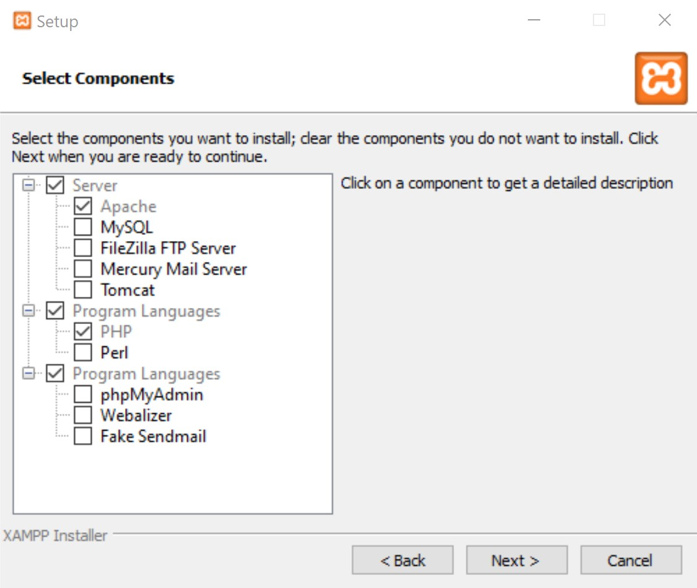
#### Utilizzo

   - XAMPP fornisce un pannello di controllo che consente di controllare l’esecuzione dei diversi moduli (nel nostro caso solo Apache).
     <br>
     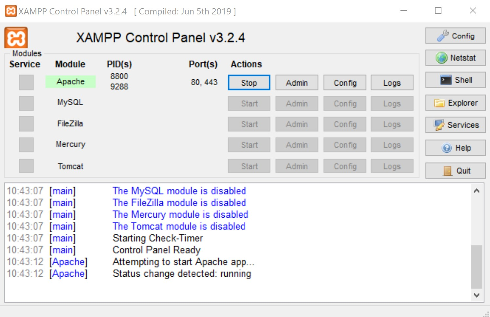

### PostgreSQL

PostgreSQL è un DBMS open source per la gestione di database relazionali.

#### Installazione

   - Scaricare dal [sito ufficiale](https://www.enterprisedb.com/downloads/postgres-postgresql-downloads) l'ultima versione di PostgreSQL.
   - Il numero di porta di default viene impostato automaticamente. Non va modificato.
     <br>
     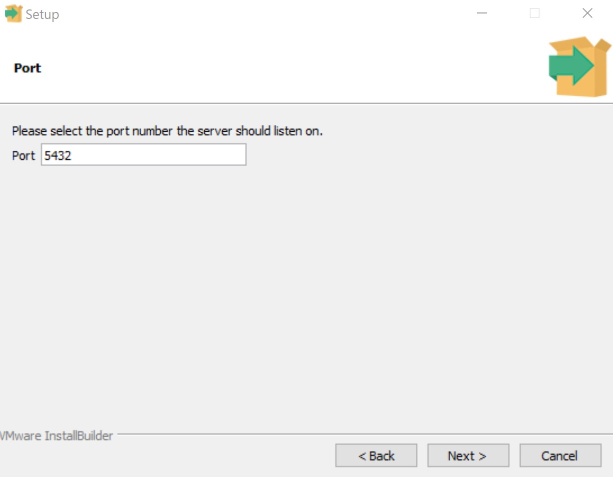
   - Il nome utente di default è **postgres**.
   - La password da impostare è **prosomap**. Sarà la password richiesta per accedere al database ed effettuare la connessione ad esso all'interno dell'applicazione.
   - E' necessario caricare le librerie client PostgreSQL per PHP, che sono già presenti. Per farlo, si deve entrare in **xampp** > **php**. Nel file **php.ini** bisogna scommentare (ovvero togliere il ;) nelle righe:
     - extension=pdo_pgsql
     - extension=pgsql
     <br>
     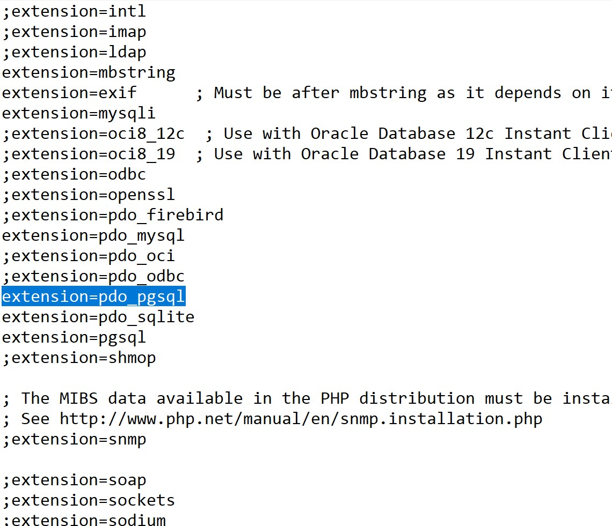
     
### PgAdmin

PgAdmin è una piattaforma open source per la gestione e lo sviluppo di database PostgreSQL.

- Scaricare l'ultima versione di pgAdmin dal [sito ufficiale](https://www.pgadmin.org/download/) e seguire i passaggi necessari per l'installazione.
- Aprire pgAdmin. Collegarsi al server PostgreSQL dal menu a sinistra, con nome utente **postgres** e password **prosomap** (è la password scelta in precedenza).
<br>
  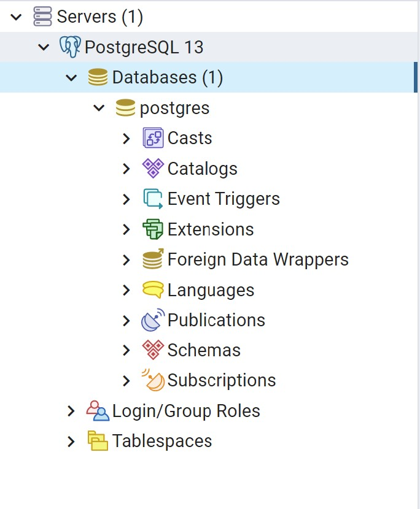

### Importare la base di dati

Nella cartella **db** del progetto sono contenuti i file di backup dello schema e dei dati del database (**prosomap-db-schema** e **prosomap-db-data**). Per utilizzarli bisogna creare un nuovo database da pgAdmin ed esportare in esso lo schema e i dati contenuti nei due file.

- Creare il nuovo database cliccando con il tasto destro la voce **Databases** dal menu a sinistra.
  <br>
  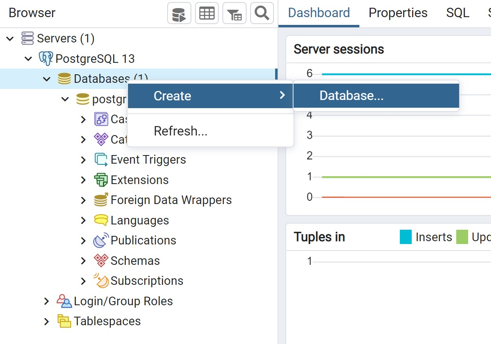
- Chiamare il database **prosomap-dev**.
  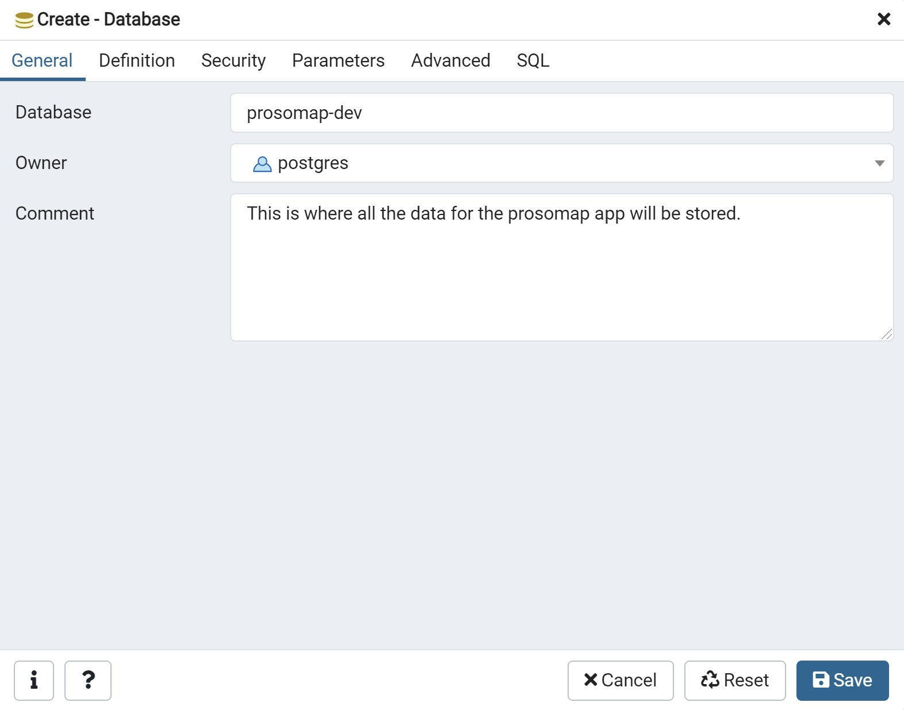
- Cliccare con il tasto destro sul database appena creato nel menu a sinistra e selezionare la voce **Query Tool**.
  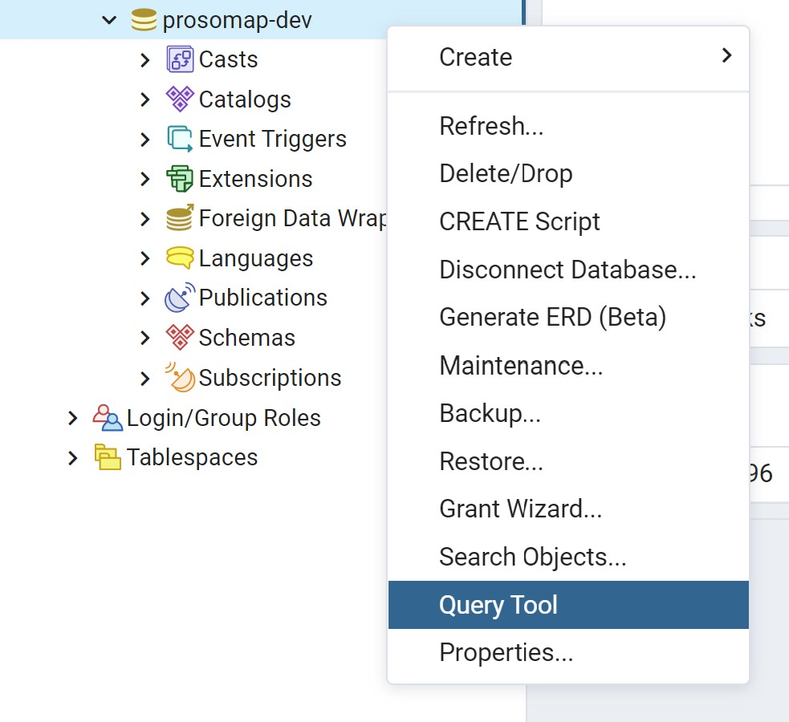
- Nella finestra che si apre a destra, copiare il contenuto del file **prosomap-db-schema** e cliccare sull'icona di **run** (evidenziata in giallo).
  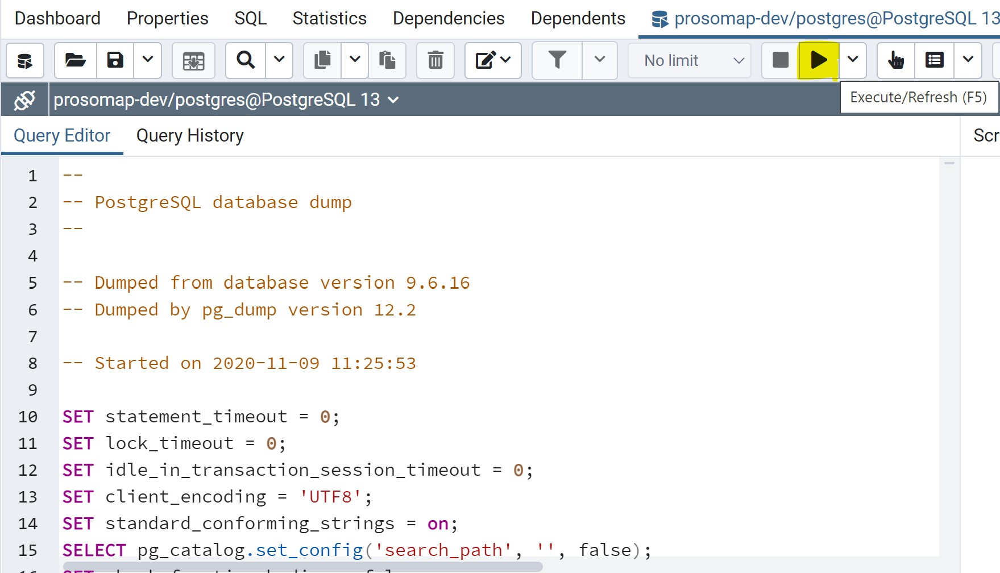
- Ripetere il passo precedente per il file **prosomap-db-data**.

## Utilizzare l'applicazione

A questo punto il back-end dell'applicazione dovrebbe funzionare correttamente. 

Per utilizzare ProsoMap è necessario scaricare la repository GitHub cliccando su **Code** > **Download ZIP**.
  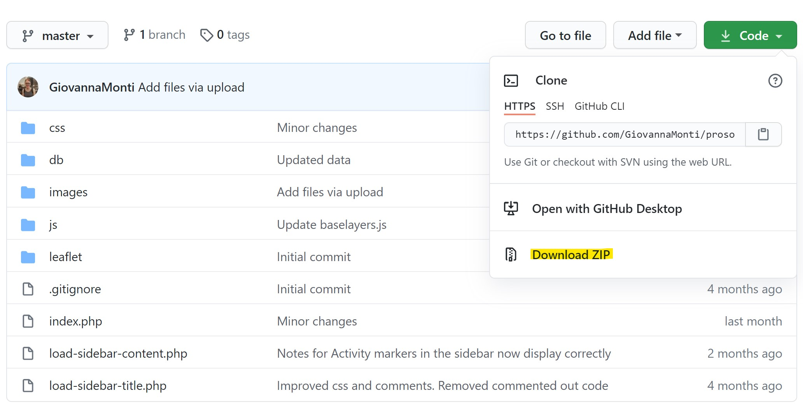

Una volta estratti i file contenuti in essa, bisogna spostare l'intera cartella in **xampp** > **htdocs**. Si dovrebbe ottenere qualcosa di simile a questo. Fare attenzione al percorso file che compare in alto:
  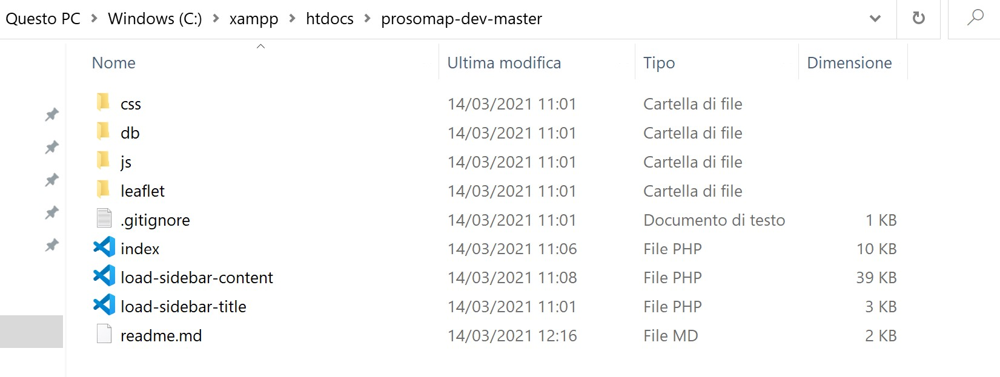

Ora assicurarsi di avviare XAMPP e accendere il server Apache dal pannello di controllo (se è già attivo poichè era già stato avviato dopo l'installazione, riavviarlo).

Digitare nel browser **localhost/prosomap-dev-master/**. Dovreste ottenere l'interfaccia funzionante di ProsoMap. 

**N.B:** l'indirizzo e la porta del localhost possono variare in base al sistema operativo o alla singola macchina su cui si esegue.

## NOTE

Se si vuole utilizzare un database con nome diverso da **prosomap-dev** o con una password diversa da **prosomap**, è possibile crearlo secondo le proprie esigenze. Per far funzionare l'applicazione andranno modificati i file **index.php** e **load-sidebar-content.php**. In entrambi i file cercare la riga:

```
$dbconn = pg_connect("dbname=prosomap-dev user=postgres password=prosomap") or die('Connection Failed');
```

e sostituire **dbname** con il nuovo nome del database, **password** con la nuova password.
